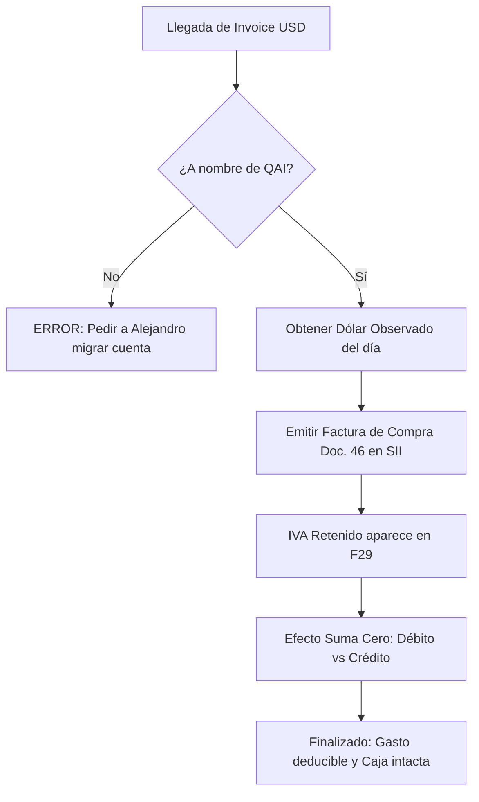

# Guía: Procesamiento de Suscripciones SaaS Extranjeras (B2B)

**Rol Responsable**: Agente Financiero (Finn) / Lex  
**Aplica a**: Servicios digitales prestados desde el extranjero (Cursor, Copilot, AWS, OpenAI, etc.) para **The QAI Company SpA**.

---

## 📅 Resumen del Ciclo Mensual

---

## 🛠️ Procedimiento Paso a Paso

### 1. Validación de Documento Original
- Verificar que la Invoice internacional incluya:
    - **Razón Social**: The QAI Company SpA
    - **RUT**: [RUT de la empresa]
    - **Monto**: En USD (o moneda original)
    - **IVA**: Debe decir $0 o "0%" (Si el proveedor cobra IVA chileno 19%, reportar incidente).

### 2. Conversión de Moneda
- Consultar el **Dólar Observado** de la fecha de emisión de la **Factura de Compra**.
- **Fórmula**: `Monto USD * Dólar Observado = Monto CLP Netos`.

### 3. Emisión de Factura de Compra (SII)
- Ingresar a `sii.cl` -> Servicios Online -> Factura Electrónica -> Sistema de facturación gratuito del SII -> **Emitir Factura de Compra (Doc. 46)**.
- **Emisor**: QAI Company SpA.
- **Receptor**: Proveedor Extranjero (Usar RUT 55.555.555-5 si no tiene uno específico).
- **Detalle**: Descripción del servicio (ej: "Suscripción mensual Cursor IDE").
- **IVA**: El sistema calculará el 19% automáticamente. Marcar la opción de **Retención Total**.

### 4. Registro y Conciliación
- La factura aparecerá automáticamente en el **Libro de Compras**.
- El Agente Financiero debe conciliar el pago de la tarjeta de crédito con el monto CLP de la Factura de Compra.

---

## 💡 Notas para el Agente Financiero (Finn)

- **Importante**: No esperes a fin de mes. Procesa cada Invoice a medida que llegue para mantener el flujo de caja y la contabilidad al día.
- **Alertas**: Si el tipo de cambio varía significativamente entre el pago y la factura, registrar la diferencia de cambio como gasto/ingreso financiero.
- **Backup**: Adjuntar siempre el PDF original de la Invoice al registro contable en la nube de QAI.

---
**Actualizado**: 26-Dic-2025  
**Estado**: Operativo para Agentes QAI
